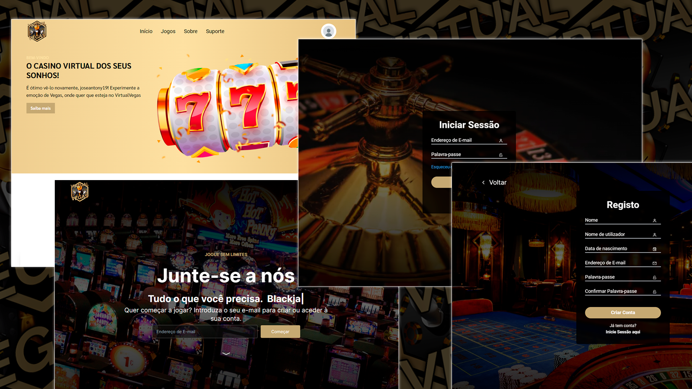

# Projeto de Desenvolvimento Baseado na Web - Virtual Vegas

This is a starter app for a MERN stack application with authentication, designed to simulate a virtual casino environment without the use of real money. This project is ideal for those looking to create a secure and entertaining online casino gaming platform.



It includes the following:

- Backend API with Express & MongoDB
- Routes for authentication, logout, register, profile, update profile
- JWT authentication stored in HTTP-only cookie
- Protected routes and endpoints
- Custom middleware to check JSON web token and store in cookie
- Custom error middleware
- React Toastify notifications
- Open AI chat assistent

## Usage

- Create a MongoDB database and obtain your `MongoDB URI` - [MongoDB Atlas](https://www.mongodb.com/cloud/atlas/register)
- Obtain your OpenAI API Key and follow the instructions `OpenAI API Key` - [OpenAI API Docs](https://platform.openai.com/docs/introduction)

### Env Variables

Rename the `.env.example` file to `.env` and add the following

```
NODE_ENV = development
PORT = 5000
MONGO_URI = your mongodb uri
JWT_SECRET = 'abc123'
chaveApi = chatgpt api key
```

Change the JWT_SECRET to what you want

### Install Dependencies (frontend & backend)

```
npm install
cd frontend
npm install
```

### Run

```
# Run frontend (:3000) & backend (:5000)
npm run dev

# Run backend only
npm run server
```

